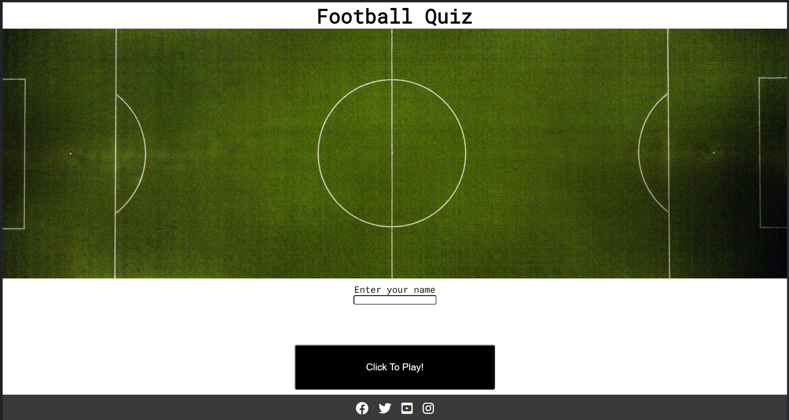
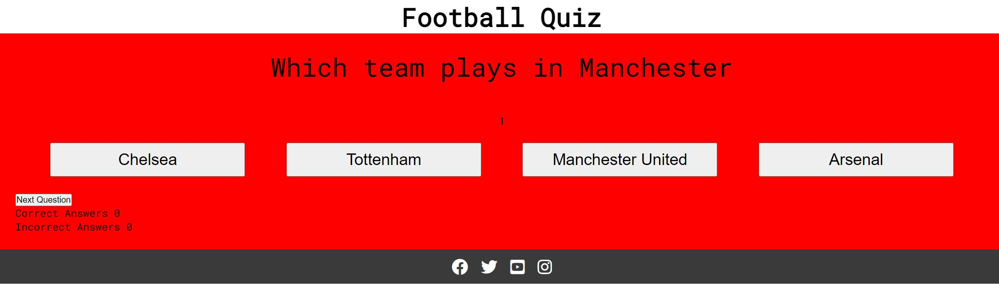
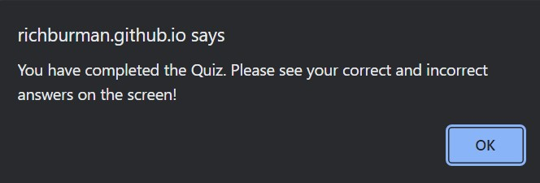
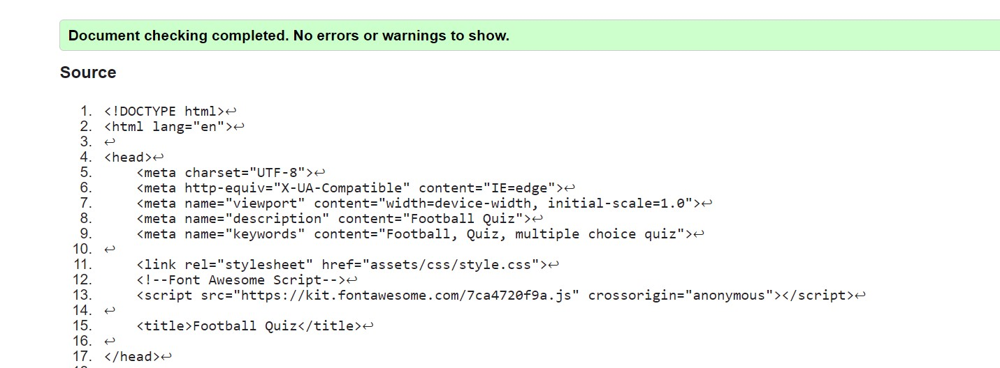
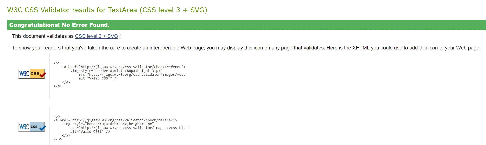
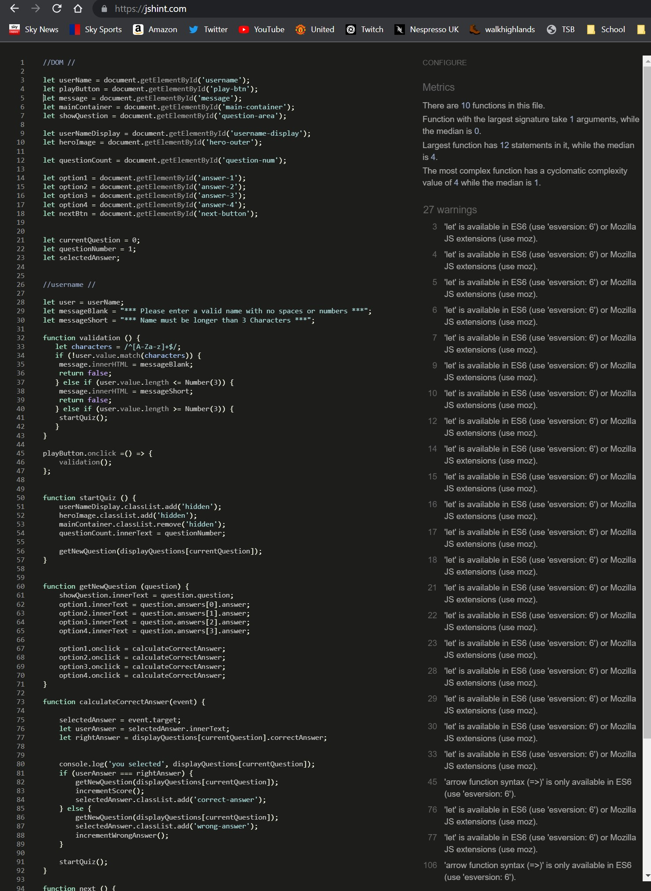

# Football Quiz

The Football Quiz website is for people who wish to take part in a fun football quiz game. The website allows users to enter their name and answer 10 football related questions to test their football knowledge. It is a exciting website for football fans around the world to test their knowledge, whilst trying to achieve 10 correct answers out of 10! 

## Features

- The landing page and hero image
    - The landing includes a hero image and header which allows the user to see what the website is about. The image includes an animation which should draw the user into the page, whilst the header details clearly what the website is about. 

- Username Entry
    - Featured on the Index Page. 
    - This allows the user to input their name before they can gain access to the Quiz questions. 
    - Users are only able to submit a name that is made up only of 'A-Z' or 'a-z' characters otherwise the following message will pop up on the screen "Please enter a valid name with no spaces or numbers" and not allow the name to be accepted until it meets the requirements.  
    - Users are not able to submit a name that is under 3 characters in length as the following message will pop up on the screen "Name must be longer than 3 Characters" and not allow the name to be accepted until it meets the requirements.  
    - Once a user has entered a name that meets the requirements, it is accepted and the User is taken to the Quiz questions. 
    This checks for validation of the username to ensure the correct information is entered into the website. 

- Click to Play! Button
    - The Click to Play! button allows the user to submit their name. If all the requirements of the Username Entry are met, clicking this button will take the user to the question area where they will be able to take part in the Quiz. 

- The Quiz
    - This is where the questions are displayed. Each questions loads 1 at a time and provides 4 answers (which are clickable buttons) for the user to click on to select their answer. 
    - Once the user clicks on a answer, if the answer is correct the box will turn green. However, if the user has clicked on a wrong answer, the answer box will turn red. 
    - The user will click on the 'next question' button to bring the next question for the user to answer. 

- Correct and Incorrect Score
    - This allows the user to see how many of the answers they have answered correctly or incorrectly. It is updated every time the User answers a question. 

- Footer
    - The footer includes links to all of the social media sites for the Football Quiz. 
    - The footer allows the user further access to the Football Quiz through their social media sites. 

    

- Message box
    - Once all 10 questions have been answered by the User, the message box displays to inform the User the following 'You have completed the Quiz. Please see your correct and incorrect answers on the screen!.' 
    - This informs the user that the Quiz has been completed and no more questions are available for the user to answer. 

    

    

- Possible Future Features to Implement

    - New question to appear after the previous question has been answered. This would allow the next button to be removed and allows for easier navigation of the website for the User
    - Once the user has selected an answer, the correct answer to show green, even if the user has selected the wrong answer. This would inform the User of the correct answer. 
    - Improved styling of the website. The website has basic styling and could be improved with images and further css styling to enhance the overall look of the website. 
    - A high score page. This would take the user name (which was inputted before starting the Quiz) and place their score out of 10 on a leader board. 
    - Additional Question pool. A pool of questions, where the website could randonly select questions to use in the quiz, so each time the user starts the quiz, they will face a different order of questions. This would allow the user to come back to the quiz and face different questions each time for a new challenge. 
    - Disabling the answer buttons after an answer has been selected. This would prevent the user from selecting multiple answers on a question. 
    - Restart/Play Again button. This would be a button or option to appear at the end of the quiz to allow the User to return the start of the quiz questions again and have another attempt of completing the quiz. 

## Testing

### HTML

- No errors were returned when passing through the official [W3C validator](https://validator.w3.org/)

- index.html 

### CSS

- No errors were returned when passing through the official [Jigsaw validator](https://jigsaw.w3.org/css-validator/)

- style.css

### JavaScript

- No key errors were returned when passing through the [JShint](https://jshint.com/)

- 27 warnings of 3 types were found 
    - 	'let' is available in ES6 (use 'esversion: 6') or Mozilla JS    
         extensions (use moz).
    -   'arrow function syntax (=>)' is only available in ES6 (use 
         'esversion: 6').
    -   'const' is available in ES6 (use 'esversion: 6') or Mozilla JS  extensions (use moz).

-script.js

### Responsive

- Am I responsive: The site is responsive to different screen sizes. Tested through [Am I Responsive?](https://amiresponsive.co.uk/)

- Website tested using Chrome devtools on various screen sizes. 
- Media Queries were added to the CSS Stylesheet:
    - Medium screen sizes from 950px wide and down

### Lighthouse

- Website tested on lighthouse
    - Perfomance 74
    - Accessibility 100
    - Best Practices 92
    - SEO 100

### Unfixed Bugs

- Images that are used on the site are rather large in size and they could be adjusted to allow for faster loading times on those with a slower internet connection

- Disabling the answer buttons after an answer has been selected. The user can select another answer after selecting their first answer this adds to the correct or incorrect scores, which would result in incorrect scoring for the quiz. 

- The correct answer isn't displaying green, to show the user the correct answer after they have selected an incorrect answer. 

## Deployment

- The site was deployed to GitHub pages. The steps to deploy are as follows:
    - In GitHub repository, naviagte to the Settings tab
    - Click on Pages
    - Select main branch and GitHub builds site from main branch

The live link is here - https://richburman.github.io/Project_2_Football_Quiz/

## Credits

### Contents

- Research using [w3schools](https://www.w3schools.com/css/css3_flexbox.asp) to learn about how to use flexbox and to learn further about JavaScript functions and coding. 

- The icons in the footer were taken from [Font Awesome](https://fontawesome.com/)
- The fonts were taken from [Google Fonts](https://fonts.google.com/)
- The football teams used in the website are members of the [Premier League](https://www.premierleague.com/)
    - [Manchester United](https://www.manutd.com/)
    - [Arsenal FC](https://www.arsenal.com/)
    - [Chelsea FC](https://www.chelseafc.com/en)
    - [Manchester City FC](https://www.mancity.com/)
    - [Liverpool FC](https://www.liverpoolfc.com/)

### Media

- All images were taken from [Unsplash](https://unsplash.com/)
- Screenshots taken from the following website for this README
    - [Lighthouse](https://web.dev/measure/)
    - [Jigsaw validator](https://jigsaw.w3.org/css-validator/)
    - [W3C validator](https://validator.w3.org/)
    - [JSHint validator](https://jshint.com/)
    - [Am I Responsive?](https://amiresponsive.co.uk/)

## Acknowledgements

- Thank you to my mentor for your support throughout my project. It has been greatly appreciated. 
- Thank you to the CI slack community for your support throughout my project. 

