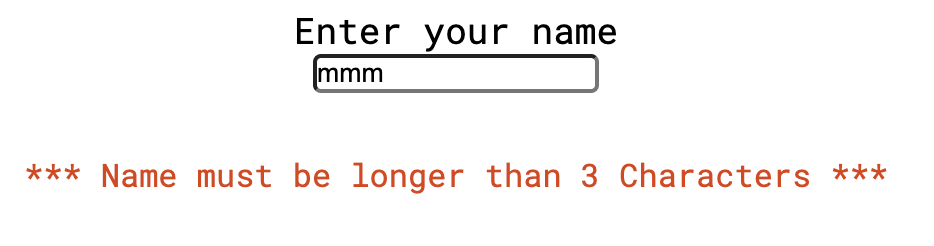

# Football Quiz

The Football Quiz website is for people who wish to take part in a fun football quiz game. The website allows users to enter their name and answer 10 football related questions to test their football knowledge. It is a exciting website for football fans around the world to test their knowledge, whilst trying to achieve 10 correct answers out of 10! 

[Here is the live version of the project](https://richburman.github.io/Project_2_Football_Quiz/)

## How it works

- The Football Quiz takes the user to a page which allows the user to enter a valid username before gaining access to the quiz. 
- Once the user has entered a valid username, the user clicks on the 'Click to Play' button, which takes the user to the question page. 
- The question page contents the following:
    - A Question
    - Question Number
    - Four answer buttons
    - Next Question button
    - Scoring 
        - Displays how many answers have been answered correctly
        - Display how many answers have been answered incorrectly
- Once the user clicks on a button to answer a question, the button will respond to the user in the following way:
    - The button will turn red if the answer is incorrect
    - The button will turn green if the answer is correct
- The scoring area will be updated after the user has clicked on an answer in the following way:
    - If the user has selected the correct answer, the correct score will increase by 1
    - If the user has selected an incorrect answer, the incorrect score will increase by 1
- Once the user has completed all 10 questions, the message and new button will appear on the screen. 
    - The message informs the user (Using their entered username) that the quiz has been completed and to click on the button to replay the quiz. 

## Features

### The landing page and hero image
- The landing includes a hero image and header which allows the user to see what the website is about. The image includes an animation which should draw the user into the page, whilst the header details clearly what the website is about. 

### Username Entry
- Featured on the Index Page. 
- This allows the user to input their name before they can gain access to the Quiz questions. 
- Users are only able to submit a name that is made up only of 'A-Z' or 'a-z' characters otherwise the following message will pop up on the screen "Please enter a valid name with no spaces or numbers" and not allow the name to be accepted until it meets the requirements.  
- Users are not able to submit a name that is under 3 characters in length. The following message will pop up on the screen "Name must be longer than 3 Characters" and not allow the name to be accepted until it meets the requirements.  
- Users are not able to submit blank spaces. 
- Once a user has entered a name that meets the requirements, it is accepted and the User is taken to the Quiz questions. This checks for validation of the username to ensure the correct information is entered into the website. 

### Click to Play! Button
- The Click to Play! button allows the user to submit their name (Username Entry). If all the requirements of the Username Entry are met, clicking this button will take the user to the question area where they will be able to take part in the Quiz. 

 

### The Quiz
- This is where the questions are displayed. Each questions loads 1 at a time and provides 4 answers (which are clickable buttons) for the user to click on to select their answer. 
- Once the user clicks on a answer, if the answer is correct the box will turn green. However, if the user has clicked on a wrong answer, the answer box will turn red. 
- Once the user has selected an answer. All of the question boxes are 'blocked' from being clicked again by the user. 
- The user will click on the 'next question' button to bring the next question for the user to answer. 

- Correct and Incorrect Score
    - This allows the user to see how many of the answers they have answered correctly or incorrectly. 
    - Each time the user answers a question, depending on whether the user answered the question correctly, this score will be updated by 1, in either the correct or incorrect field. 

- Footer
    - The footer includes links to all of the social media sites for the Football Quiz. 
    - The footer allows the user further access to the Football Quiz through their social media sites. 

 

### Message box
- Once all 10 questions have been answered by the user and a message and button appears at the bottom of the quiz. 
- Using the username the user entered at the start of the quiz, it says 'Hello' to the user. It informs the user that the quiz has been completed and advises to click the button to replay the quiz. This returns the user to the start website to try the quiz again.

 

   

## Possible Future Features to Implement

- New question to appear after the previous question has been answered. This would allow the next button to be removed and allows for easier navigation of the website for the user
- Once the user has selected an answer, the correct answer to show green, even if the user has selected the wrong answer. This would inform the User of the correct answer. 
- Improved styling of the website. The website has basic styling and could be improved with images and further css styling to enhance the overall look of the website. 
- A high score page. This would take the user name (which was inputted before starting the Quiz) and place their score out of 10 on a leader board. 
- Additional Question pool. A pool of questions, where the site could randomly select questions to use in the quiz, so each time the user starts the quiz, they will face a different order of questions.  This would allow the user to come back to the quiz and face different questions each time for a new challenge. 

## Testing

### Manual Testing

I have manually tested this project by undetaking the following steps:
- I have tested the validation of the username entry. This ensures the input has the following:
    - No numbers

     

    - No blank spaces

     
    - Longer than 3 characters 

     

- I have tested the 'Click to Play!' button, to ensure that once clicked it takes the user to the quiz page. 

- I have tested the function of blocking out the answer buttons once the user has clicked on an answer. This prevents the user from clicking on a different answer and changing the score, if they had orginally selected an incorrect answer. 

 

- I have tested the 'Next Question' button to ensure that once clicked it loads the next question for the user on the page. 

- I have tested the 'Retry Quiz' button to ensure that once clicked it send the user to the start of the quiz, ready to start the quiz again. 

- HTML - No errors were returned when passing through the official [W3C validator](https://validator.w3.org/)
- CSS - - No errors were returned when passing through the official [Jigsaw validator](https://jigsaw.w3.org/css-validator/)
- JavaScript - - No key errors were returned when passing through the [JShint](https://jshint.com/)

### HTML

- index.html 

 

### CSS

- style.css

 

### JavaScript

- No key errors were returned when passing through the [JShint](https://jshint.com/)

- 34 warnings of 4 types were found 
    - 	'let' is available in ES6 (use 'esversion: 6') or Mozilla JS    
         extensions (use moz).
    -   'arrow function syntax (=>)' is only available in ES6 (use 
         'esversion: 6').
    -   'const' is available in ES6 (use 'esversion: 6') or Mozilla JS  extensions (use moz).
    - One undefined variable - line 123 Count

-script.js

 

 

 

 

 

### Responsive

- Am I responsive: The site is responsive to different screen sizes. Tested through [Am I Responsive?](https://amiresponsive.co.uk/)

- Website tested using Chrome devtools on various screen sizes. 
- Media Queries were added to the CSS Stylesheet:
    - For larger to medium screens size from 1200px wide and down
    - Medium screen sizes from 950px wide and down

### Lighthouse

- Website tested on lighthouse
    - Perfomance 83
    - Accessibility 100
    - Best Practices 100
    - SEO 100

 

### Fixed Bugs

- The user is now able to return to the start of the quiz, once they have completed all the questions. Previously, once the user had completed all the questions, the user was unable to nagivate from this page. 
- The username entered at the start of the quiz is display at the end of the quiz which improves the experience of the quiz for the user. Previously, the username was entered and this not brought up in the quiz again. 
- The answer buttons on the quiz are now 'blocked out' once a user has clicked and selected an answer to a question. This prevents the user from selecting more than one answer. Previously, the user was able to select multiply answers, which affected the validity of the quiz and the scoring system. 

### Unfixed Bugs

- None

## Deployment

- The site was deployed to GitHub pages. The steps to deploy are as follows:
    - In GitHub repository, naviagte to the Settings tab
    - Click on Pages
    - Select main branch and GitHub builds site from main branch

The live link is here - https://richburman.github.io/Project_2_Football_Quiz/

## Credits

### Contents

- Research using [w3schools](https://www.w3schools.com/css/css3_flexbox.asp) to learn about how to use flexbox and to learn further about JavaScript functions and coding. 

- The icons in the footer were taken from [Font Awesome](https://fontawesome.com/)
- The fonts were taken from [Google Fonts](https://fonts.google.com/)
- The football teams used in the website are members of the [Premier League](https://www.premierleague.com/)
    - [Manchester United](https://www.manutd.com/)
    - [Arsenal FC](https://www.arsenal.com/)
    - [Chelsea FC](https://www.chelseafc.com/en)
    - [Manchester City FC](https://www.mancity.com/)
    - [Liverpool FC](https://www.liverpoolfc.com/)

### Media

- All images were taken from [Unsplash](https://unsplash.com/)
- Screenshots taken from the following website for this README
    - [Lighthouse](https://web.dev/measure/)
    - [Jigsaw validator](https://jigsaw.w3.org/css-validator/)
    - [W3C validator](https://validator.w3.org/)
    - [JSHint validator](https://jshint.com/)
    - [Am I Responsive?](https://amiresponsive.co.uk/)

## Acknowledgements

- Thank you to my mentor for your support throughout my project. It has been greatly appreciated. 
- Thank you to the CI slack community for your support throughout my project. 

